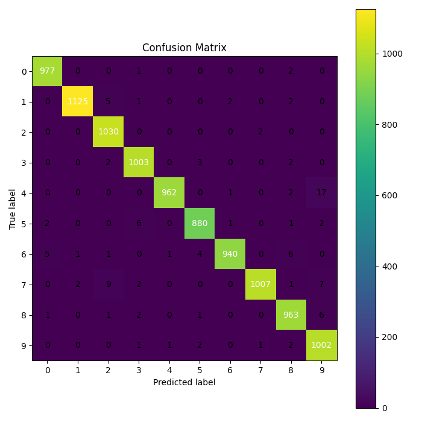
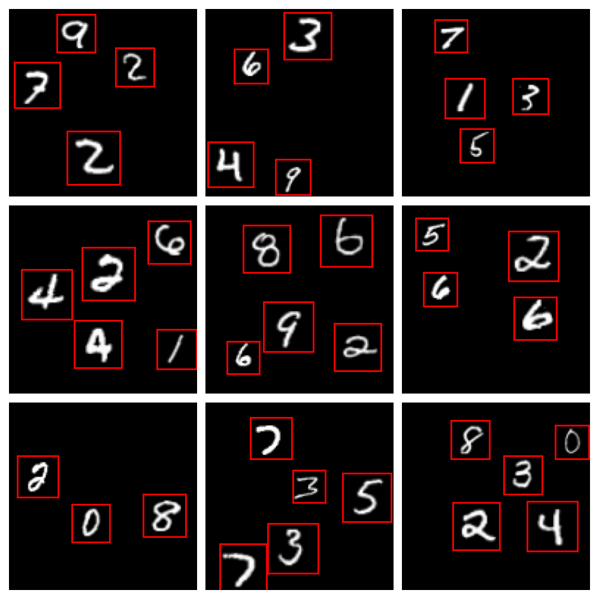
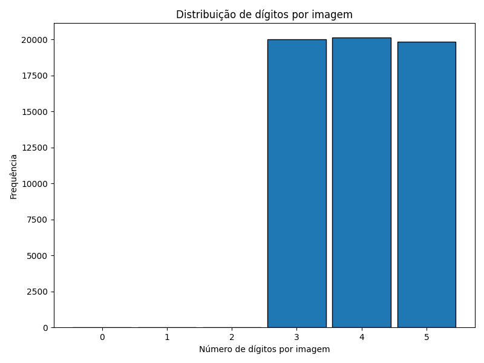
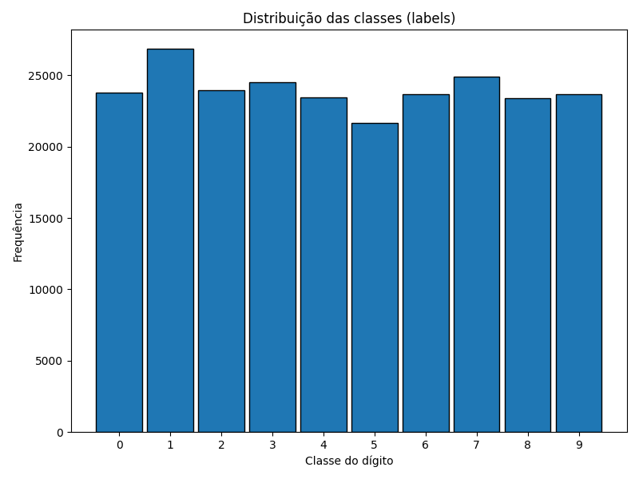
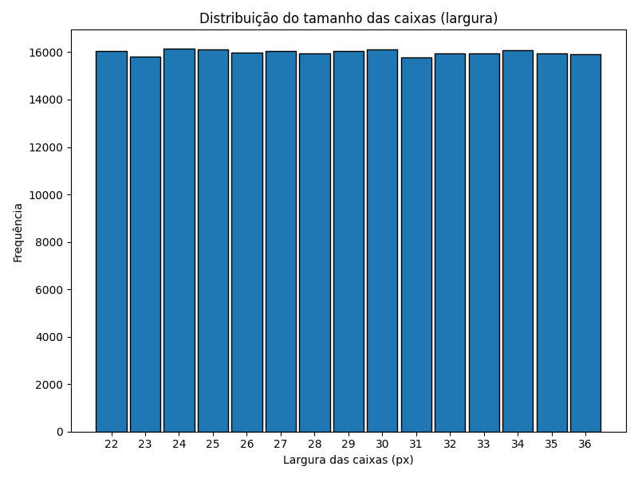
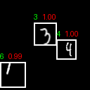
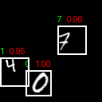
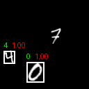

# Trabalho Prático 2 – SAVI
**Classificação e Deteção de Dígitos Manuscritos com CNNs**

Miguel Riem Oliveira  
SAVI – 2025/2026

---

## Introdução

Este trabalho explora a utilização de Redes Neuronais Convolucionais (CNNs) para evoluir de um problema clássico de classificação (MNIST) para um cenário mais complexo de deteção e classificação de múltiplos dígitos em imagens maiores. O projeto é desenvolvido de forma incremental, permitindo analisar as limitações e vantagens de diferentes abordagens.

---

## Tarefa 1 – Classificação MNIST

### Metodologia
Foi implementada uma CNN treinada com o dataset MNIST completo (60.000 imagens de treino e 10.000 de teste). A arquitetura inclui duas camadas convolucionais seguidas de pooling e camadas totalmente ligadas.

### Avaliação
A avaliação foi realizada no conjunto de teste, com:
- Matriz de confusão
- Precision, Recall e F1-Score por classe
- Médias globais (macro)

### Resultados
A CNN alcançou elevada accuracy no conjunto de teste, com desempenho consistente em todas as classes.

---

## Tarefa 2 – Geração de Dataset de Cenas

### Metodologia
Foi desenvolvido um gerador de cenas sintéticas com dígitos MNIST posicionados aleatoriamente em imagens 128×128. Foram criadas quatro versões do dataset:

- **A**: 1 dígito, sem escala
- **B**: 1 dígito, com escala
- **C**: múltiplos dígitos, sem escala
- **D**: múltiplos dígitos, com escala

As imagens incluem anotações em formato JSON com bounding boxes e labels.

### Análise
Foram analisadas:
- Distribuição de classes
- Número de dígitos por imagem
- Dimensão média das bounding boxes

---

## Tarefa 3 – Deteção por Janela Deslizante

### Metodologia
A CNN treinada na Tarefa 1 foi utilizada como classificador numa abordagem de Sliding Window. A imagem é percorrida por janelas de vários tamanhos, sendo cada recorte classificado individualmente.

Para reduzir falsos positivos foram usados:
- Threshold de confiança
- Margem entre as duas classes mais prováveis
- Entropia da distribuição softmax
- Filtro de sobreposição (IoU + intensidade média)

### Discussão
Apesar de funcional, esta abordagem apresenta:
- Elevado custo computacional
- Muitos falsos positivos
- Deteções redundantes

---

## Tarefa 4 – Detetor e Classificador Integrado

### Metodologia
Para superar as limitações da janela deslizante, foi implementada uma abordagem baseada em **Region Proposals**, utilizando segmentação clássica:

1. Segmentação por thresholding e morfologia
2. Extração de componentes conectados
3. Filtragem geométrica (área, proporção)
4. Classificação das regiões com a CNN da Tarefa 1
5. Pós-processamento com Non-Maximum Suppression

Esta abordagem reduz drasticamente o número de regiões avaliadas e melhora a eficiência.

### Comparação T3 vs T4

| Critério | Sliding Window | Region Proposals |
|--------|----------------|------------------|
| Nº de forward passes | Muito elevado | Reduzido |
| Velocidade | Lenta | Rápida |
| Falsos positivos | Muitos | Menos |
| Complexidade | Bruta | Estruturada |

---

## Dificuldades

- Gestão de falsos positivos na Sliding Window
- Ajuste de thresholds
- Segmentação robusta em imagens com múltiplos dígitos
- Garantir compatibilidade entre MNIST e cenas sintéticas

---

## Conclusão

O trabalho demonstrou a evolução de um classificador simples para um sistema completo de deteção de objetos. A abordagem baseada em Region Proposals mostrou-se significativamente mais eficiente e adequada para este tipo de problema.

